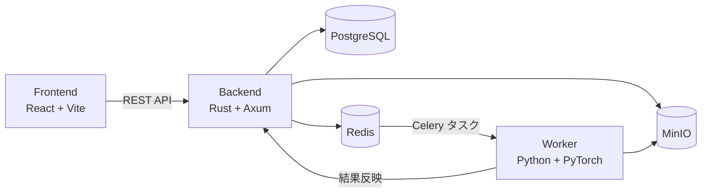

# MIAOS

**M**embership **I**nference **A**ttack **O**rchestration **S**ystem

機械学習モデルに対する **Membership Inference Attack (MIA)** の実験を、Web UI から作成・管理し、非同期ワーカーに実行を委譲するオーケストレーションシステムです。

実験パラメータと結果メトリクスは PostgreSQL で管理し、学習済みモデルや ROC 曲線などの成果物は MinIO（S3 互換）に保存します。ジョブの配送には Celery / Redis を用います。

[English README](README.md)

## システム構成



| コンポーネント | 技術スタック | 役割 |
| -------------- | ------------ | ---- |
| **Orchestrator / Frontend** | React, TypeScript, Vite, TanStack Query | 実験・タスクの一覧表示、作成、削除 |
| **Orchestrator / Backend** | Rust, Axum, SeaORM, Celery | REST API、DB 管理、タスクエンキュー、ファイル配信 |
| **Worker** | Python, PyTorch, Celery | MIA 実験の実行（LiRA / Shokri）、成果物のアップロード |

## リポジトリ構成

```text
MIAOS/
├── orchestrator/          # オーケストレータ（フロントエンド + バックエンド + インフラ）
│   ├── backend/           # Rust API サーバー
│   ├── frontend/          # React SPA
├── worker/                # Celery ワーカー（GPU 実験実行）
├── schema/                # OpenAPI スキーマ（自動生成の共有元）
└── Makefile               # ルートからの一括操作
```

## ドキュメント

各コンポーネントの詳細は、それぞれのディレクトリ内の仕様書を参照してください。

### Orchestrator / Backend

API エンドポイント、データモデル、レイヤードアーキテクチャ、環境変数、Celery 連携など。

→ [orchestrator/backend/docs/SPECIFICATION.md](orchestrator/backend/docs/SPECIFICATION.md)

### Orchestrator / Frontend

アーキテクチャ全体像、ディレクトリ構成、データフロー、設計方針。

→ [orchestrator/frontend/docs/ARCHITECTURE.md](orchestrator/frontend/docs/ARCHITECTURE.md)

コンポーネント・カスタムフック・API 通信の詳細仕様。

→ [orchestrator/frontend/docs/COMPONENTS.md](orchestrator/frontend/docs/COMPONENTS.md)

### Worker

実験パイプライン、攻撃手法（LiRA / Shokri）、MinIO 連携、OpenAPI 生成クライアント。

→ [worker/docs/SPECIFICATION.md](worker/docs/SPECIFICATION.md)

## クイックスタート

### 前提

- Docker / Docker Compose
- Worker の GPU 実行には NVIDIA Container Toolkit

### 開発環境の起動

リポジトリルートから、オーケストレータとワーカーをまとめて起動します。

```bash
make prod
```

個別に起動する場合:

```bash
make -C orchestrator prod   # PostgreSQL, Redis, MinIO, Backend, Frontend
make -C worker prod         # Celery ワーカー（GPU）
```

開発時の主なエンドポイント:

| サービス | URL |
| -------- | --- |
| Frontend | http://localhost:80 |
| Backend API | http://localhost:80/api/ |
| Swagger UI | http://localhost:80/docs/ |
| OpenAPI JSON | http://localhost:80/api/openapi.json |
| MinIO Console | http://localhost:9001 |
| MinIO | http://localhost:9000 |
| Redis | http://localhost:6379 |


### Dev Container

`orchestrator/.devcontainer/` および `worker/.devcontainer/` を用意しています。VS Code / Cursor の **Dev Containers: Open Folder in Container** から各コンポーネントの開発環境を開けます。

## OpenAPI 連携

バックエンドの `utoipa` 定義から `schema/openapi.json` を生成し、フロントエンド（`openapi-typescript`）とワーカー（`openapi-python-client`）のクライアントを同期します。

```bash
make openapi-update
```

API スキーマを変更した場合は、上記を実行してから各コンポーネントを再ビルドしてください。

## サードパーティ

本プロジェクトは [rusty-celery](https://github.com/rusty-celery/rusty-celery)（Apache-2.0）をフォークして利用しています。変更内容は [THIRD_PARTY_NOTICES.md](THIRD_PARTY_NOTICES.md) を参照してください。

## ライセンス

本プロジェクトは [Apache License 2.0](LICENSE) の下で公開されています。
