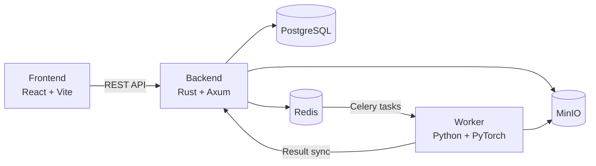

# MIAOS

[](https://www.rust-lang.org/)
[](https://www.python.org/)
[](https://react.dev/)
[](https://www.docker.com/)
[](https://opensource.org/licenses/Apache-2.0)

**M**embership **I**nference **A**ttack **O**rchestration **S**ystem

An orchestration system for creating and managing **Membership Inference Attack (MIA)** experiments against machine learning models via a web UI, delegating execution to asynchronous workers.

Experiment parameters and result metrics are managed in PostgreSQL; artifacts such as trained models and ROC curves are stored in MinIO (S3-compatible). Celery / Redis is used for job delivery.

[日本語 README](README.ja.md)

## System Architecture



| Component | Tech Stack | Role |
| --------- | ---------- | ---- |
| **Orchestrator / Frontend** | React, TypeScript, Vite, TanStack Query | List, create, and delete experiments and tasks |
| **Orchestrator / Backend** | Rust, Axum, SeaORM, Celery | REST API, DB management, task enqueueing, file delivery |
| **Worker** | Python, PyTorch, Celery | Run MIA experiments (LiRA / Shokri), upload artifacts |

## Repository Layout

```text
MIAOS/
├── orchestrator/          # Orchestrator (frontend + backend + infrastructure)
│   ├── backend/           # Rust API server
│   ├── frontend/          # React SPA
├── worker/                # Celery worker (GPU experiment execution)
├── schema/                # OpenAPI schema (shared source for code generation)
└── Makefile               # Top-level commands
```

## Documentation

See the specification documents in each component directory for details.

### Orchestrator / Backend

API endpoints, data models, layered architecture, environment variables, Celery integration, and more.

→ [orchestrator/backend/docs/SPECIFICATION.md](orchestrator/backend/docs/SPECIFICATION.md)

### Orchestrator / Frontend

Overall architecture, directory layout, data flow, and design principles.

→ [orchestrator/frontend/docs/ARCHITECTURE.md](orchestrator/frontend/docs/ARCHITECTURE.md)

Detailed specs for components, custom hooks, and API communication.

→ [orchestrator/frontend/docs/COMPONENTS.md](orchestrator/frontend/docs/COMPONENTS.md)

### Worker

Experiment pipeline, attack methods (LiRA / Shokri), MinIO integration, and OpenAPI-generated client.

→ [worker/docs/SPECIFICATION.md](worker/docs/SPECIFICATION.md)

## Quick Start

### Prerequisites

- Docker / Docker Compose
- NVIDIA Container Toolkit for GPU execution on the worker

### Starting the Environment

From the repository root, start the orchestrator and worker together:

```bash
make prod
```

To start them individually:

```bash
make -C orchestrator prod   # PostgreSQL, Redis, MinIO, Backend, Frontend
make -C worker prod         # Celery worker (GPU)
```

Main endpoints during development:

| Service | URL |
| ------- | --- |
| Frontend | http://localhost:80 |
| Swagger UI | http://localhost:80/docs/ |
| Backend API | http://localhost:80/api/ |
| OpenAPI JSON | http://localhost:80/api/openapi.json |
| MinIO Console | http://localhost:9001 |
| MinIO | http://localhost:9000 |
| Redis | http://localhost:6379 |

### Dev Container

Dev container definitions are available under `orchestrator/.devcontainer/` and `worker/.devcontainer/`. Open each component's development environment via **Dev Containers: Open Folder in Container** in VS Code / Cursor.

## OpenAPI Integration

The backend's `utoipa` definitions generate `schema/openapi.json`, which is used to sync clients for the frontend (`openapi-typescript`) and worker (`openapi-python-client`).

```bash
make openapi-update
```

After changing the API schema, run the command above and rebuild each component.

## Third-Party Software

This project forks and uses [rusty-celery](https://github.com/rusty-celery/rusty-celery) (Apache-2.0). See [THIRD_PARTY_NOTICES.md](THIRD_PARTY_NOTICES.md) for modification details.

## License

This project is licensed under the [Apache License 2.0](LICENSE).
