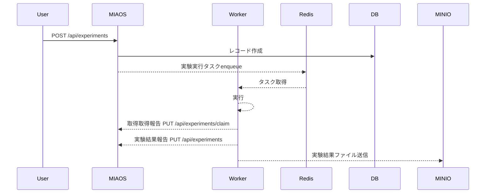

# システム仕様書 (System Specification)

## 1. システム概要 (Overview)

本システムは、機械学習モデルに対する **Membership Inference Attack (MIA)** などの実験を管理・自動実行するためのバックエンド API サーバーです。
実験のパラメータ（ハイパーパラメータやデータセットの分割比率など）を管理し、非同期タスクキューを用いて重い実験処理をワーカーに委譲します。また、実験結果のメトリクスや生成されたアーティファクト（MinIO 上のオブジェクトキーなど）を一元管理し、**S3 互換 API** 経由でオブジェクトを取得するエンドポイントを提供します。

## 2. アーキテクチャ (Architecture)

本システムは Rust で実装されており、以下の技術スタックとアーキテクチャを採用しています。

### 技術スタック

- **Web Framework**: Axum（`tower-http` の `TraceLayer` で HTTP リクエストのトレース）
- **API ドキュメント**: utoipa + Swagger UI（OpenAPI 3）
- **ORM**: SeaORM（PostgreSQL）
- **Task Queue**: Celery（Broker: Redis、`rusty-celery` 経由でブローカーと通信）
- **Object Storage**: MinIO（S3 互換。クライアントは **AWS SDK for Rust (`aws-sdk-s3`)**。path-style、固定 **BehaviorVersion** でクライアント構築）

### レイヤードアーキテクチャ

システムは以下のレイヤーに分割されています。

1. **Handlers (`src/handlers/`)**: HTTP リクエストの受け取り、レスポンスの返却。
2. **Services (`src/services/`)**: ビジネスロジック、複数リポジトリのオーケストレーション。
3. **Repositories (`src/repositories/`)**: DB・Redis（Celery）・S3（MinIO）へのアクセス抽象化。
4. **Entities (`src/entities/`)**: データベースのテーブルと 1 対 1 で対応するモデル定義。
5. **DTO (`src/dto/`)**: API リクエスト／レスポンス用のデータ転送オブジェクト。

### アプリケーション状態 (`AppState`)

HTTP 層には **`AppState`** を 1 つの状態として渡し、Axum の **`FromRef<AppState>`** により、ハンドラごとに `State<Arc<ExperimentService<…>>>` や `State<Arc<StorageService<…>>>` を注入します（実験用とストレージ用でサービス型を分けつつ、ルーターの state 型を統一する構成）。

## 3. データモデル (Data Models)

### Experiment (実験)

実験の条件、進行状態、および結果を保持する主要なエンティティです。

- **基本情報**: ID, 実験名 (`name`), 備考 (`notes`), 攻撃手法 (`method`: `offline_lira`, `shokri`)
- **実験条件**: バッチサイズ, 最大エポック数, シャドウモデル数, 各種データサイズ, シード値, その他ハイパーパラメータ（JSONB）
- **データ流用**: ベースとなる実験 ID (`base_experiment_id`), ターゲット／シャドウ／攻撃モデルのロードフラグ
- **状態管理**: ステータス (`WAITING`, `RUNNING`, `SUCCEEDED`, `FAILED`), 作業 PC 名 (`worker_name`), 完了日時, エラーメッセージ
- **実験結果**: 全体 AUC, 各 FPR における TPR と閾値（**1% FPR** と **0.1% FPR**）, その他メトリクス（JSONB）, 実行時間（秒）
- **ファイル**: アーティファクト等の参照を **`files`（JSONB）** に集約して保持

### Task (タスク)

Celery キューに登録される非同期タスクの情報を表します（詳細は `entities/task` およびタスク系 API を参照）。

## 4. API エンドポイント (API Endpoints)

実 HTTP パスは **`/api` プレフィックス**付きです。下表の「エンドポイント」列はそのままリクエストパスです。

| メソッド | エンドポイント | 説明 |
| -------- | ---------------- | ---- |
| `GET` | `/api/experiments` | 登録されているすべての実験一覧を取得します。 |
| `POST` | `/api/experiments` | 新しい実験を作成し、Celery に非同期タスクをエンキューします。 |
| `PUT` | `/api/experiments` | ワーカーが実験結果や `files` 等をシステムに反映（完了／失敗の報告）します。 |
| `PUT` | `/api/experiments/claim` | ワーカーが待機中の実験を取得し、`RUNNING` へ遷移させます。 |
| `DELETE` | `/api/experiments/{id}` | 指定 ID の実験を削除します。 |
| `GET` | `/api/tasks` | タスク一覧を取得します。 |
| `DELETE` | `/api/tasks/{id}` | 指定 ID のタスクを削除（キャンセル）します。 |
| `GET` | `/api/files/{*key}` | MinIO（S3）上のオブジェクトをストリーミングで返します。`key` は **複数パスセグメント**を含められます（例: `test/sample.log`）。ハンドラ側で **URL デコード**（`%2F` → `/` など）も行います。 |

### OpenAPI / Swagger UI

| 説明 | URL |
| ---- | --- |
| Swagger UI | `GET /docs` |
| OpenAPI JSON | `GET /api-docs/openapi.json` |

## 5. 非同期タスクフロー (Asynchronous Task Flow)

実験の実行は、API サーバーとワーカー（別プロセス）の間で非同期に行われます。

1. **実験の登録 (API)**  
   - ユーザーが `POST /api/experiments` に実験条件を送信します。  
   - システムは DB に `Experiment` レコードを `WAITING` 状態で作成します。  
   - 成功後、Celery ブローカー（Redis）に実験実行タスクをエンキューします。

2. **実験の取得 (Worker → API)**  
   - ワーカーは `PUT /api/experiments/claim`（リクエストボディに実験 ID 等）で待機中の実験を確保し、ステータスを `RUNNING` に更新します。

3. **タスクの実行 (Worker)**  
   - ワーカーが Redis からタスクをフェッチし、機械学習の実験（MIA など）を実行します。  
   - 必要に応じて MinIO からオブジェクトを取得し、成果物を MinIO にアップロードします。

4. **結果の反映 (Worker → API)**  
   - 完了時、ワーカーは `PUT /api/experiments` を呼び出し、評価メトリクスと `files` 等を送信します。  
   - システムは該当 `Experiment` を更新し、ステータスや結果を保存します。

## 6. 実行時環境変数 (Runtime Environment)

起動時に参照される主な変数です（未設定の必須項目はパニックします）。

| 変数 | 用途 |
| ---- | ---- |
| `DATABASE_URL` | PostgreSQL 接続（SeaORM） |
| `REDIS_URL` | Redis（Deadpool、Celery ブローカー） |
| `MINIO_ACCESS_KEY` / `MINIO_SECRET_KEY` | MinIO 認証 |
| `MINIO_ENDPOINT` | MinIO のエンドポイント URL |
| `MINIO_BUCKET_NAME` | 既定バケット名 |
| `MINIO_REGION` | リージョン（省略時は `us-east-1`） |

## 7. ローカル開発メモ

- 既定の HTTP 待受ポートは **3000**（`main.rs` の `SERVER_PORT`）。  
- `cargo run` は `Cargo.toml` の `default-run = "server"` により API サーバーバイナリが起動します。  
- コンテナベースのビルド手順はリポジトリ直下の **`Dockerfile`**（`cargo-chef` によるマルチステージ等）を参照してください。
