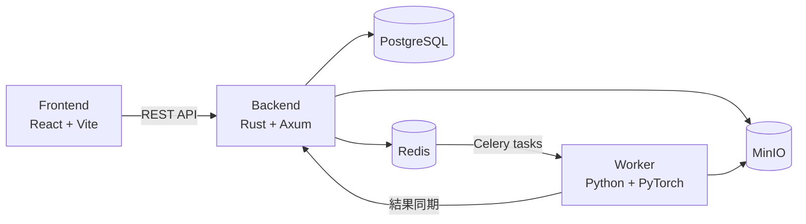
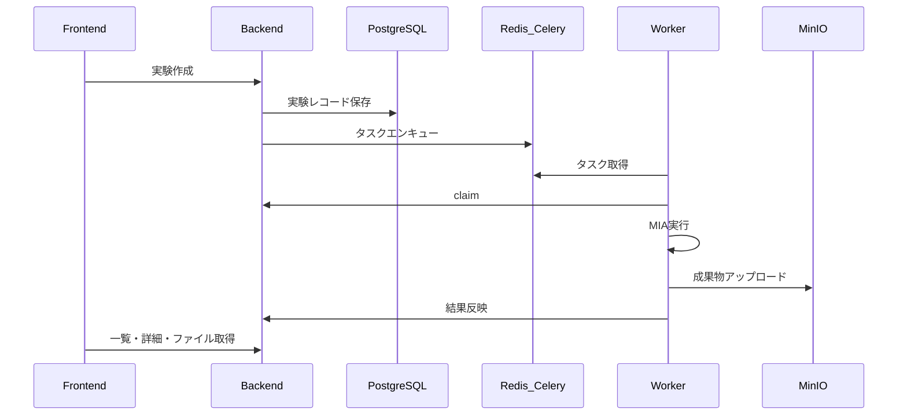
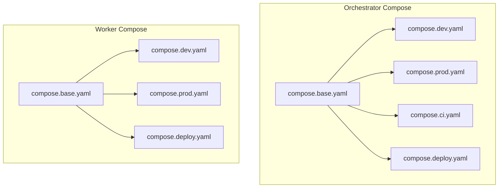
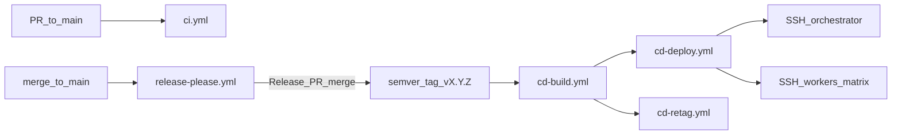
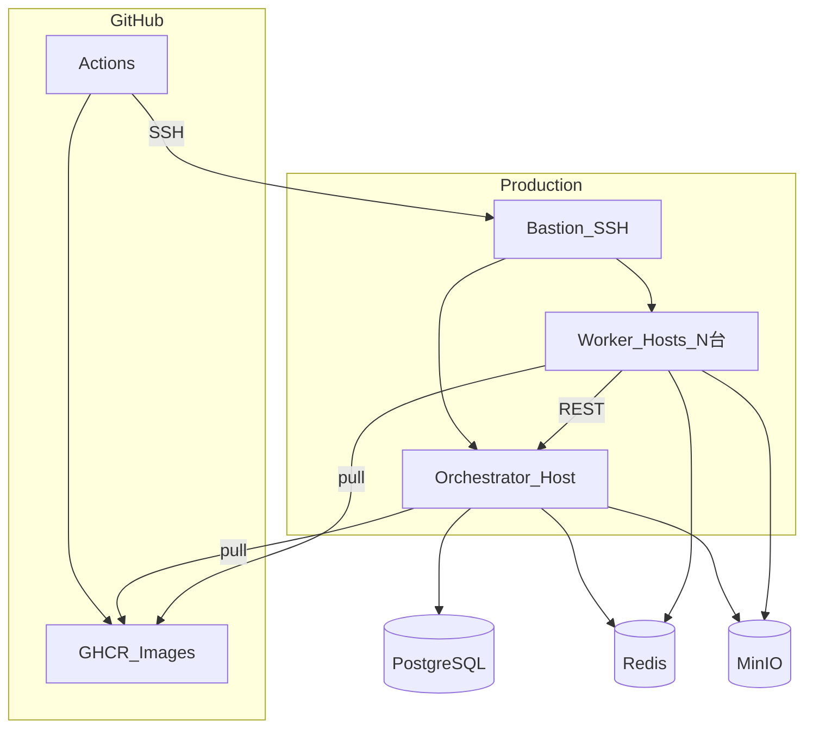

# MIAOS アーキテクチャ

**M**embership **I**nference **A**ttack **O**rchestration **S**ystem の全体設計書。コードの実装詳細は各コンポーネントの仕様書に委譲し、本書ではシステム構成・インフラ・CI/CD・デプロイの俯瞰を扱う。

## ドキュメントの位置づけ

| ドキュメント | 役割 |
| --- | --- |
| 本書 (`architecture.md`) | 全体像・インフラ・CI/CD・デプロイ |
| [README.md](README.md) | クイックスタート・入門 |
| 各コンポーネントの `docs/` | API・実装仕様 |

---

## 1. システム概要

MIAOS は、機械学習モデルに対する **Membership Inference Attack (MIA)** 実験を Web UI から作成・管理し、非同期 Worker に実行を委譲するオーケストレーションシステムである。

| データ種別 | 保存先 | 内容 |
| --- | --- | --- |
| 実験パラメータ・メトリクス | PostgreSQL | 実験状態、ハイパーパラメータ、AUC 等 |
| ジョブキュー | Redis (Celery ブローカー) | 実験タスクの配送 |
| アーティファクト | MinIO (S3 互換) | 学習済みモデル、ROC 曲線、ログ等 |

### ランタイム構成



### 実験ライフサイクル



---

## 2. コンポーネント責務

| 領域 | 技術スタック | 責務 |
| --- | --- | --- |
| Orchestrator / Frontend | React, TypeScript, Vite, TanStack Query | 実験・タスクの一覧・作成・削除、REST 呼び出し |
| Orchestrator / Backend | Rust, Axum, SeaORM, Celery | REST API、DB 管理、タスクエンキュー、ファイル配信 |
| Worker | Python, PyTorch, Celery | LiRA / Shokri による MIA 実行、MinIO・API 連携 |
| インフラ | PostgreSQL, Redis, MinIO | 永続化・キュー・オブジェクトストレージ |

Backend は Handlers → Services → Repositories のレイヤード構成を採用し、HTTP 層・ビジネスロジック・永続化を分離する。Worker は Celery タスク受信後、API で実験を claim し、パイプライン実行・MinIO へのアップロード・API への結果反映という一連の流れで処理する。

攻撃手法として **offline LiRA** と **Shokri** をサポートする。既存実験のアーティファクトを流用した実験も可能である。

---

## 3. リポジトリ構成

```text
MIAOS/
├── orchestrator/          # Frontend + Backend + インフラ Compose
│   ├── backend/           # Rust API サーバー
│   ├── frontend/          # React SPA
│   └── .devcontainer/     # 開発用 Dev Container 定義
├── worker/                # Celery Worker (GPU 実験実行)
│   └── .devcontainer/
├── schema/                # OpenAPI スキーマ (クライアント生成の共有ソース)
├── .github/               # CI/CD ワークフロー・デプロイスクリプト
└── Makefile               # トップレベルコマンド (dev/prod, openapi-update)
```

Orchestrator と Worker は **別ディレクトリ・別ホスト** で独立して動作できる。Worker は環境変数で Orchestrator の Redis・API・MinIO に接続する。

---

## 4. OpenAPI による契約共有

Backend の API 定義が `schema/openapi.json` の単一ソースとなり、Frontend と Worker のクライアントを同期する。

| コンポーネント | 生成ツール | 生成物 |
| --- | --- | --- |
| Backend | utoipa | `schema/openapi.json` |
| Frontend | openapi-typescript | 型定義 |
| Worker | openapi-python-client | HTTP クライアント |

API スキーマ変更時は `make openapi-update` でスキーマ生成と各クライアントの再生成を行う。CI ではスキーマと生成物の整合性を `git diff` で検証する。

---

## 5. Docker Compose 設計

Compose は **ベース定義 + 環境別オーバーレイ** のパターンを採用する。`compose.base.yaml` にサービス定義・依存関係・ヘルスチェックを集約し、用途ごとの YAML でビルド方法・イメージ参照・ボリュームを上書きする。



### 設計上の要点

- `container_name` は付与しない。スケールや Compose プロジェクト名の一貫性を保つため。
- ビルドは Dockerfile、起動・依存管理は Compose に分離する。
- Orchestrator の DB データは VM ローカルボリュームに配置する（NAS マウントは I/O 遅延による破損リスクを避けるため）。

### Orchestrator

| ファイル | 用途 |
| --- | --- |
| `compose.base.yaml` | redis, minio, db, create_buckets, backend, frontend の共通定義 |
| `compose.dev.yaml` | ローカル開発（ソースマウント、dev ビルドターゲット） |
| `compose.prod.yaml` | ローカル本番相当（イメージビルド、restart ポリシー） |
| `compose.ci.yaml` | CI 専用（frontend 無効化、cargo キャッシュマウント） |
| `compose.deploy.yaml` | 本番デプロイ（GHCR イメージ pull） |
| `compose.deploy.init.yaml` | 本番インフラ初回起動（profiles: infra / init） |
| `compose.deploy.local.yaml` | 手動デプロイ検証用 |

本番初回セットアップでは `compose.deploy.init.yaml` の profiles を使い、インフラ（PostgreSQL, Redis, MinIO）とバケット作成のみを先行起動する。MinIO のデータ領域は NAS マウントを想定している。

### Worker

| ファイル | 用途 |
| --- | --- |
| `compose.base.yaml` | `ito_research` サービス（GPU, 共有メモリ, 環境変数, ヘルスチェック） |
| `compose.dev.yaml` | 開発（ソースマウント、ヘルスチェック無効） |
| `compose.prod.yaml` | ローカル本番相当 |
| `compose.deploy.yaml` | 本番（GHCR イメージ、`stop_grace_period: 1h` で graceful shutdown） |
| `compose.deploy.manual.yaml` | 手動デプロイ（grace period なし） |

Worker デプロイでは `stop` → `up` の順でコンテナを更新し、Celery の warm shutdown により実行中タスクの完了を待ってから新イメージに切り替える。

---

## 6. ローカル開発・起動

### 前提

- Docker / Docker Compose
- Worker の GPU 実行には NVIDIA Container Toolkit

### 起動コマンド

| コマンド | 内容 |
| --- | --- |
| `make dev` | orchestrator + worker を開発モードで起動 |
| `make prod` | 両方をローカル本番相当で起動 |
| `make -C orchestrator dev` | orchestrator のみ |
| `make -C worker dev` | worker のみ |

### 主要エンドポイント

| サービス | URL |
| --- | --- |
| Frontend | http://localhost:80 |
| Swagger UI | http://localhost:80/docs/ |
| Backend API | http://localhost:80/api/ |
| OpenAPI JSON | http://localhost:80/api/openapi.json |
| MinIO Console | http://localhost:9001 |
| MinIO API | http://localhost:9000 |

### Dev Container

`orchestrator/.devcontainer/` と `worker/.devcontainer/` に開発環境定義がある。VS Code / Cursor の **Dev Containers: Open Folder in Container** で各コンポーネントのディレクトリを開いて利用する。

---

## 7. CI/CD (GitHub Actions)

### 全体フロー



### ci.yml — Pull Request 時

`main` への PR で起動する。`paths` ジョブが変更ファイルを検知し、backend / frontend / worker のいずれか（または複数）を選択実行する。同一ブランチで新しい実行が始まると、進行中の古い実行はキャンセルされる。

| ジョブ | 主な処理 |
| --- | --- |
| Backend | compose.ci で db/redis/minio 起動 → Docker ビルド → DB マイグレーション → format/clippy/統合テスト → OpenAPI 生成・同期確認 → prod ビルド検証 |
| Frontend | 依存インストール → OpenAPI 型同期確認 → lint → prod ビルド検証 |
| Worker | 依存インストール → format/lint → OpenAPI クライアント同期確認 → prod ビルド検証 |

CI 定義ファイルや `schema/openapi.json` の変更時は、該当コンポーネントのテストをすべて実行する。

### release-please.yml — main への push 時

Release Please によりバージョン管理を行う。未リリースの変更がある場合は Release PR を作成し、マージ時に semver タグと GitHub Release を作成する。

タグ作成には `RELEASE_PLEASE_TOKEN` (PAT) を使用する。`GITHUB_TOKEN` でタグを付与すると、他のワークフロー（CD Build 等）が起動しないためである。

### cd-build.yml — semver タグ push 時 (`v*.*.*`)

3 つのコンテナイメージを GHCR にビルド・push する。

| イメージ | パス |
| --- | --- |
| orchestrator-backend | `ghcr.io/<repository>/orchestrator-backend` |
| orchestrator-frontend | `ghcr.io/<repository>/orchestrator-frontend` |
| worker | `ghcr.io/<repository>/worker` |

付与タグ: コミット short SHA と `latest`。CD はキャンセルしない（中断による不整合を防ぐ）。

### cd-retag.yml — CD Build 完了後

CD Build 成功時に、GHCR イメージへ semver タグ（例: `v0.1.3`）を追加付与する。Release Please 内でのポーリング待機を workflow_run トリガーに置き換えた構成である。

### cd-deploy.yml — CD Build 成功後

CD Build 完了をトリガーに本番環境へデプロイする。`production` 環境の Secrets / Variables を参照する。

| ジョブ | 処理 |
| --- | --- |
| deploy-orchestrator | Bastion 経由 SSH → リポジトリ checkout → `deploy-orchestrator.sh` |
| deploy-workers-shared-home | `vars.WORKER_HOSTS.shared_home` を `max-parallel: 1` で直列デプロイ（NAS 共有ホームの git 競合回避） |
| deploy-workers-independent | `vars.WORKER_HOSTS.independent` を並列デプロイ |

`vars.WORKER_HOSTS` は JSON オブジェクトで登録する。

```json
{
  "shared_home": ["10.0.0.1", "10.0.0.2"],
  "independent": ["10.0.0.3"]
}
```

Worker は `fail-fast: false` により、1 台の失敗が他台のデプロイを中断しない。`shared_home` と `independent` の2ジョブは互いに並列実行される。

### デプロイスクリプト

| スクリプト | 処理概要 |
| --- | --- |
| `deploy-common.sh` | GHCR ログイン、`IMAGE_TAG` をコミット short SHA に設定 |
| `deploy-orchestrator.sh` | 新イメージ pull → backend/frontend を `--no-deps` で再起動 → ヘルスチェック待機 |
| `deploy-worker.sh` | 新イメージ pull → graceful stop → 新イメージで起動 → ヘルスチェック待機（最大 60 分） |

---

## 8. 本番デプロイ構成



Orchestrator ホストに PostgreSQL・Redis・MinIO・Backend・Frontend が同居する。Worker は複数台構成を想定し、いずれも Orchestrator の Redis・MinIO・API にネットワーク経由で接続する。

### 初回セットアップ

本番ホストでリポジトリを配置し、環境変数を設定したうえで以下を実行する。

```bash
make -C orchestrator deploy-init
```

インフラ（PostgreSQL, Redis, MinIO）の起動と MinIO バケット作成を行う。Backend / Frontend は CD デプロイで更新する。

### 手動デプロイ

GHCR イメージを指定してローカル検証する場合:

```bash
make -C orchestrator deploy-local    # IMAGE_TAG を指定可能
make -C worker deploy-manual
```

---

## 9. コンテナイメージ

各コンポーネントの Dockerfile は multi-stage ビルドを採用し、`dev` / `prod` ターゲットを切り替える。

| ターゲット | 用途 |
| --- | --- |
| dev | ローカル開発（ソースマウント、ホットリロード） |
| prod | 本番・CI/CD（最小イメージ） |

CI では dev ターゲットでテストを実行し、prod ターゲットのビルド可否を検証する。CD では prod ターゲットを GHCR に push する。

---

## 10. 関連ドキュメント

### Orchestrator / Backend

API エンドポイント、データモデル、レイヤードアーキテクチャ、環境変数、Celery 連携等。

→ [orchestrator/backend/docs/SPECIFICATION.md](orchestrator/backend/docs/SPECIFICATION.md)

### Orchestrator / Frontend

全体アーキテクチャ、ディレクトリ構成、データフロー、設計方針。

→ [orchestrator/frontend/docs/ARCHITECTURE.md](orchestrator/frontend/docs/ARCHITECTURE.md)

コンポーネント・カスタムフック・API 通信の詳細仕様。

→ [orchestrator/frontend/docs/COMPONENTS.md](orchestrator/frontend/docs/COMPONENTS.md)

### Worker

実験パイプライン、攻撃手法 (LiRA / Shokri)、MinIO 連携、OpenAPI 生成クライアント。

→ [worker/docs/SPECIFICATION.md](worker/docs/SPECIFICATION.md)
