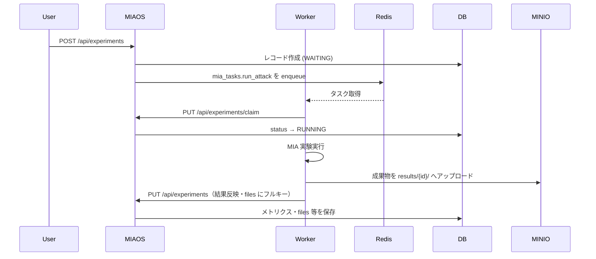

# システム仕様書 (System Specification)

## 1. システム概要 (Overview)

本システムは **MIAOS (Member Inference Attack Orchestration System)** のバックエンド API サーバーです。機械学習モデルに対する **Membership Inference Attack (MIA)** などの実験を管理・自動実行します。

実験のパラメータ（ハイパーパラメータやデータセットの分割比率など）を PostgreSQL で管理し、非同期タスクキュー（Celery / Redis）を用いて重い実験処理をワーカーに委譲します。また、実験結果のメトリクスや生成されたアーティファクト（MinIO 上のオブジェクトキーなど）を一元管理し、**S3 互換 API** 経由でオブジェクトを取得するエンドポイントを提供します。透かし用の **32×32 フィルタ画像** は MinIO 上で管理し、一覧取得・アップロード API を提供します（合成ロジックはワーカー側）。

## 2. アーキテクチャ (Architecture)

本システムは Rust で実装されており、以下の技術スタックとレイヤードアーキテクチャを採用しています。

### 技術スタック

| 領域 | 採用技術 |
| ---- | -------- |
| Web Framework | Axum（`tower-http` の `TraceLayer` で HTTP リクエストのトレース） |
| API ドキュメント | utoipa + Swagger UI（OpenAPI 3） |
| ORM / DB マイグレーション | SeaORM + sqlx（起動時に `migrations/` を自動適用） |
| Task Queue | Celery（Broker: Redis。Rust クライアントは `celery` クレート。`libs/rusty-celery` でパッチ適用） |
| Redis 接続プール | deadpool-redis |
| Object Storage | MinIO（S3 互換。クライアントは **AWS SDK for Rust (`aws-sdk-s3`)**。path-style、**BehaviorVersion `v2026_01_12`** でクライアント構築） |
| メモリ割り当て | mimalloc（グローバルアロケータ） |
| ログ | tracing + tracing-subscriber（`AppConfig::log_level` で制御） |

### レイヤードアーキテクチャ

| レイヤー | パス | 役割 |
| -------- | ---- | ---- |
| Handlers | `src/handlers/` | HTTP リクエストの受け取り、レスポンスの返却（`experiment`, `file`, `filter`, `health`） |
| Services | `src/services/` | ビジネスロジック、複数リポジトリのオーケストレーション（`experiment`, `file`, `filter`） |
| Repositories | `src/repositories/` | DB・Redis（Celery）・S3（MinIO）へのアクセス抽象化（トレイトでモック可能） |
| Entities | `src/entities/` | ドメインモデル（DB テーブルおよび Celery タスク表現） |
| DTO | `src/dto/` | API リクエスト／レスポンス、Celery タスク引数用のデータ転送オブジェクト（`experiment`, `filter`, `task`, `health`） |
| Infrastructure | `src/infrastructure.rs` | DB / Redis / Celery / MinIO 接続の確立、ヘルスチェック用 ping |
| Config | `src/config/` | 起動設定（`app.rs`）および実験作成時のデフォルトパラメータ（`default.rs`） |
| State | `src/state.rs` | Axum へ注入するアプリケーション状態 |

### アプリケーション状態

HTTP 層には 2 種類の状態を渡します。

#### `AppState`（ビジネス API 用）

- `experiment_service`: 実験・タスクの CRUD と Celery エンキュー
- `storage_service`: MinIO からのオブジェクト取得
- `filter_service`: 透かし用フィルタ画像の一覧取得・アップロード

Axum の **`FromRef<AppState>`** により、ハンドラごとに `State<Arc<ExperimentService<…>>>`、`State<Arc<StorageService<…>>>`、`State<Arc<FilterService<…>>>` を注入します。

#### `HealthState`（ヘルスチェック用）

- `db_pool`, `redis_pool`, `client`（S3）, `bucket_name` を保持し、リーディネスチェックで各依存先への疎通を確認します。

### 起動シーケンス（`main.rs`）

1. `AppConfig::from_env()` で環境変数を読み込み（失敗時はエラーログ出力のうえ終了）
2. ロガー初期化（`config.log_level`、未設定時は `info`）
3. PostgreSQL / Redis / Celery / MinIO クライアントの接続確立（`&AppConfig` を渡す）
4. `sqlx::migrate!("./migrations")` による DB マイグレーション適用
5. `AppState` / `HealthState` の構築
6. `config.server_port`（未設定時は **3000**）で HTTP サーバー起動

### 設定 (`AppConfig`)

起動時の環境変数は `config/app.rs` の **`AppConfig`** に集約されます。

- **`AppConfig::from_env()`** — 本番・開発用。必須変数の欠落は `ConfigError::Missing`、不正な値は `ConfigError::Invalid` を返します。
- **`AppConfig::test_defaults()`** — 統合テスト用。ログレベルは `debug` 固定、ポートは `3000` 固定。

## 3. データモデル (Data Models)

### Experiment（実験）

PostgreSQL の `experiments` テーブルに対応する主要エンティティです（SeaORM エンティティ: `entities::experiment::Model`）。

| カテゴリ | フィールド | 説明 |
| -------- | ---------- | ---- |
| 基本情報 | `id`, `name`, `notes`, `method` | 攻撃手法は `offline_lira` / `shokri`（PostgreSQL ENUM） |
| 実験条件 | `batch_size`, `max_epochs`, `num_shadow_models`, 各種データサイズ, `seed`, `hyperparameters`（JSONB） | `CreateExperimentRequest` の未指定項目は `config/default.rs` の値を使用。透かし設定は `hyperparameters.watermark` に格納（バックエンドはパススルー、ワーカーが解釈） |
| データ流用 | `base_experiment_id`, `load_target_model`, `load_shadow_model`, `load_attack_model` | 既存実験結果の再利用フラグ |
| 状態管理 | `status`, `worker_name`, `completed_at`, `error_message` | ステータス遷移は下記「状態遷移ルール」参照 |
| 実験結果 | `global_auc`, `tpr_at_1_fpr`, `threshold_at_1_fpr`, `tpr_at_01_fpr`, `threshold_at_01_fpr`, `other_metrics`（JSONB）, `total_time` | 1% FPR / 0.1% FPR における TPR・閾値 |
| ファイル | `files`（JSONB） | アーティファクトの MinIO オブジェクトキー参照。キーは表示用の相対パス、値はバケット内フルキー（例: `results/42/roc_curve.png`） |

#### `hyperparameters.watermark`（参考）

バックエンドはスキーマ検証を行わず JSONB として保存・Celery へ渡します。ワーカーが解釈する透かし設定の例:

```json
{
  "watermark": {
    "enabled": true,
    "filter_id": "circle",
    "apply": {
      "target_train": 1.0,
      "shadow_train": 0.5
    },
    "seed_offset": 0
  }
}
```

| キー | 説明 |
| ---- | ---- |
| `filter_id` | MinIO キー `filters/{filter_id}.png` の ID |
| `apply` | 分割名 → 付与割合（0.0–1.0）。値 ≤ 0 またはキーなしは未適用 |
| `seed_offset` | 透かし対象選定シード = `seed + seed_offset` |

有効な `apply` キー: `target_train`, `target_test`, `shadow_train`, `shadow_test`
| メタ情報 | `created_at` | 作成日時（DB デフォルト: `NOW()`） |

#### 状態遷移ルール

`ExperimentStatus` はドメイン層で遷移を検証します。不正な遷移は **`409 Conflict`** を返します。

| 操作 | 許可される遷移 | 検証メソッド |
| ---- | -------------- | ------------ |
| 処理取得（claim） | `WAITING` → `RUNNING` | `can_claim()` |
| 結果反映（complete） | `RUNNING` → `SUCCEEDED` または `FAILED` | `can_complete_to()` |

ドメインメソッド:

- `Model::claim()` — ワーカーによる処理取得報告。`WAITING` 以外の場合は `ServerError::Conflict`
- `Model::complete()` — ワーカーによる結果反映。`RUNNING` 以外、または終了ステータスが `SUCCEEDED`/`FAILED` 以外の場合は `ServerError::Conflict`

### Task（タスク）

DB テーブルではなく、**Redis の Celery ブローカーキュー**（リストキー `celery`）上のメッセージをパースした表現です（`entities::task::Task`）。

| フィールド | 説明 |
| ---------- | ---- |
| `id` | Celery タスク UUID |
| `task` | タスク名（`mia_tasks.run_attack`） |
| `experiment_id` | 紐づく実験 ID |
| `args_positional`, `args_keyword`, `args_control` | Celery メッセージボディ（Base64 デコード後）の引数 |

Celery タスク定義は `infrastructure::run_attack`（`#[celery::task(name = "mia_tasks.run_attack")]`）。エンキュー時の引数は `dto::task::CreateTaskRequest`（実験レコードから `From` で変換）。

## 4. API エンドポイント (API Endpoints)

実 HTTP パスは下表のとおりです。

### HTTP エラーレスポンス

`ServerError` は Axum の `IntoResponse` により次のステータスコードにマッピングされます（レスポンスボディはプレーンテキスト）。

| ステータス | 条件 |
| ---------- | ---- |
| `400 Bad Request` | 無効なファイルキー（`..` を含む等）、フィルタ ID・画像のバリデーションエラー、multipart 不正 |
| `404 Not Found` | 実験・タスク・オブジェクトが存在しない |
| `409 Conflict` | 実験ステータスの不正遷移（二重 claim、未 claim での結果反映等）、フィルタ ID の重複登録 |
| `500 Internal Server Error` | DB / Redis / Celery / S3 等の内部エラー |

### MinIO オブジェクトレイアウト

バケット内の主要プレフィックスは次のとおりです（旧 `{experiment_id}/` 直下レイアウトは非対応）。

| プレフィックス | 内容 |
| -------------- | ---- |
| `filters/{id}.png` | 共有 32×32 RGBA 透かしフィルタ画像 |
| `results/{experiment_id}/` | 実験成果物（`dataset.json`, モデル, グラフ, `watermark_preview.png` 等） |

`StorageRepository` は `get_object` に加え `list_objects`、`put_object`、`object_exists` を提供します。フィルタ管理は `FilterService`（`src/services/filter.rs`）が担当します。

### 実験・タスク・ファイル・フィルタ

| メソッド | エンドポイント | 説明 | 主なエラー |
| -------- | -------------- | ---- | ---------- |
| `GET` | `/api/experiments` | 登録されているすべての実験一覧を取得 | — |
| `POST` | `/api/experiments` | 新しい実験を作成し、Celery に非同期タスクをエンキュー | `500` |
| `PUT` | `/api/experiments` | ワーカーが実験結果や `files` 等を反映（完了／失敗の報告） | `404`, `409`, `500` |
| `PUT` | `/api/experiments/claim` | ワーカーが待機中の実験を取得し、`RUNNING` へ遷移 | `404`, `409`, `500` |
| `DELETE` | `/api/experiments/{id}` | 指定 ID の実験を削除（関連 Celery タスクも削除） | `404`, `500` |
| `GET` | `/api/tasks` | Redis キュー上のタスク一覧を取得 | `500` |
| `DELETE` | `/api/tasks/{id}` | 指定 UUID のタスクをキューから削除（キャンセル） | `404`, `500` |
| `GET` | `/api/files/{key}` | MinIO 上のオブジェクトをストリーミングで返す | `400`, `404`, `500` |
| `GET` | `/api/filters` | 登録済みフィルタ ID 一覧を取得 | `500` |
| `POST` | `/api/filters` | フィルタ PNG をアップロード（`multipart/form-data`） | `400`, `409`, `500` |

**ファイル取得 (`/api/files/{key}`) の補足:**

- パスは **1 セグメント**（`{key}`）。スラッシュを含むキーは **URL エンコード**して渡す（例: `test%2Fsample.log` → デコード後 `test/sample.log`）。
- ハンドラ側で URL デコード（`%2F` → `/` など）を実施。
- `..` を含むキーは `400 Bad Request` で拒否。
- 未エンコードの複数パスセグメント（`/api/files/a/b`）にはマッチしません。将来、クエリパラメータ方式への変更を検討する余地あり。
- 実験成果物は `results/{experiment_id}/...`、フィルタ画像は `filters/{id}.png` など、**バケット内フルキー**をそのまま渡します。

**フィルタ API (`/api/filters`) の補足:**

- **一覧 (`GET`)**: `filters/` プレフィックス配下のオブジェクトから ID を抽出し、JSON `{ "filters": [{ "id": "circle" }, ...] }` を返します。
- **アップロード (`POST`)**: `multipart/form-data` で `id`（フィルタ ID）と `file`（PNG バイナリ）を受け取ります。
- **バリデーション**: ID は `^[a-zA-Z0-9_-]+$`。画像は PNG のみ、**32×32** 固定。同一 ID が既に存在する場合は `409 Conflict`。
- **保存先**: MinIO キー `filters/{id}.png`（`Content-Type: image/png`）。
- **プレビュー**: 既存の `GET /api/files/{key}` を流用（例: `filters/circle.png`）。

### ヘルスチェック（OpenAPI 未掲載）

| メソッド | エンドポイント | 説明 |
| -------- | -------------- | ---- |
| `GET` | `/health/live` | ライブネス。プロセス生存確認（常に `{"status":"ok"}`） |
| `GET` | `/health/ready` | リーディネス。DB / Redis / MinIO への疎通を並行チェック。全成功時 `status: "ok"`（HTTP 200）、いずれか失敗時 `status: "degraded"`（HTTP 503） |

リーディネスレスポンス例:

```json
{
  "status": "ok",
  "checks": {
    "database": "ok",
    "redis": "ok",
    "storage": "ok"
  }
}
```

### OpenAPI / Swagger UI

| 説明 | URL |
| ---- | --- |
| Swagger UI | `GET /docs` |
| OpenAPI JSON | `GET /api/openapi.json` |

OpenAPI 定義は `routes::ApiDoc`（utoipa）から生成されます。

- ファイル出力: `make generate-openapi` または `cargo run --bin generate_openapi`
- 注: `409 Conflict` 等の一部エラーレスポンスは OpenAPI 定義に未掲載の場合があります。

## 5. 非同期タスクフロー (Asynchronous Task Flow)



1. **実験の登録 (API)**  
   - ユーザーが `POST /api/experiments` に実験条件を送信。  
   - システムは DB に `Experiment` レコードを `WAITING` 状態で作成。  
   - 成功後、`mia_tasks.run_attack` タスクを Celery ブローカー（Redis）にエンキュー。  
   - タスク登録に失敗した場合は、作成済みの実験レコードをロールバック（削除）します。

2. **実験の取得 (Worker → API)**  
   - ワーカーは `PUT /api/experiments/claim`（ボディ: `id`, `worker_name`）で実験を確保し、ステータスを `RUNNING` に更新。  
   - 既に `RUNNING` 以降の実験に対する claim は `409 Conflict` となります。

3. **タスクの実行 (Worker)**  
   - ワーカーが Redis からタスクをフェッチし、MIA 実験を実行。  
   - 透かし有効時は MinIO から `filters/{filter_id}.png` を取得し、データセットに合成。  
   - ベース実験流用時は `results/{base_experiment_id}/` 配下から成果物をダウンロード。  
   - 成果物は MinIO の `results/{experiment_id}/` プレフィックスへアップロード。

4. **結果の反映 (Worker → API)**  
   - 完了時、ワーカーは `PUT /api/experiments` を呼び出し、評価メトリクスと `files` 等を送信。  
   - `files` の値には MinIO フルキー（例: `results/42/roc_curve.png`）を格納する。  
   - システムは該当 `Experiment` を更新し、ステータス・結果を保存。  
   - `RUNNING` 以外の状態からの結果反映は `409 Conflict` となります。

## 6. 実行時環境変数 (Runtime Environment)

`AppConfig::from_env()` が参照する変数です。必須項目が未設定の場合は起動時に `ConfigError` となり、サーバーは終了します。

| 変数 | 必須 | 既定値 | 用途 |
| ---- | ---- | ------ | ---- |
| `DATABASE_URL` | はい | — | PostgreSQL 接続（SeaORM） |
| `REDIS_URL` | はい | — | Redis（Deadpool、Celery ブローカー） |
| `MINIO_ACCESS_KEY` | はい | — | MinIO 認証 |
| `MINIO_SECRET_KEY` | はい | — | MinIO 認証 |
| `MINIO_ENDPOINT` | はい | — | MinIO のエンドポイント URL |
| `MINIO_BUCKET_NAME` | はい | — | 既定バケット名 |
| `MINIO_REGION` | いいえ | `us-east-1` | リージョン |
| `LOG_LEVEL` | いいえ | `info` | ログレベル（tracing） |
| `SERVER_PORT` | いいえ | `3000` | HTTP 待受ポート |

### DB 接続プール（参考）

`infrastructure::establish_db_connection` の主な設定:

| 項目 | 値 |
| ---- | -- |
| `max_connections` | 5 |
| `idle_timeout` | 30 分 |
| `max_lifetime` | 60 分 |

## 7. ローカル開発メモ

### 起動

- `cargo run` は `Cargo.toml` の `default-run = "server"` により API サーバーバイナリが起動します。  
- 起動時に `migrations/` 配下の SQL マイグレーションが自動適用されます。  
- Celery クライアントは `Cargo.toml` の `[patch.crates-io]` により `libs/rusty-celery` で上書きされています。  
- コンテナベースのビルド手順はリポジトリ直下の **`Dockerfile`**（`cargo-chef` によるマルチステージ等）を参照してください。

### Makefile ターゲット

| コマンド | 説明 |
| -------- | ---- |
| `make format` | `cargo fmt --all` |
| `make lint` | `cargo clippy --all-targets --all-features`（警告をエラー扱い） |
| `make test` | `cargo test` |
| `make test-integration` | `cargo test --all-features -- --test-threads=1`（Redis 等の外部依存テスト。並列実行しない） |
| `make check` | format チェック + lint + test-integration（CI 向け） |
| `make migrate` | `sqlx migrate run` |
| `make migrate-add NAME=...` | マイグレーションファイル作成 |
| `make generate-openapi` | OpenAPI JSON を `/schema/openapi.json` に出力 |

### テスト

- DB 連携テストは `#[sqlx::test]` を使用し、トランザクションのロールバックでデータをクリーンアップします。  
- Redis / MinIO を使うテストは `integration-test` feature 下にあり、`make test-integration` で実行します。  
- 統合テストの接続設定には `AppConfig::test_defaults()` を使用します。
