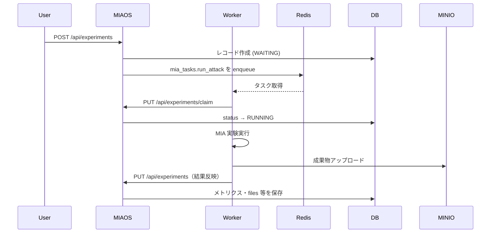

# システム仕様書 (System Specification)

## 1. システム概要 (Overview)

本システムは **MIAOS (Member Inference Attack Orchestration System)** のバックエンド API サーバーです。機械学習モデルに対する **Membership Inference Attack (MIA)** などの実験を管理・自動実行します。

実験のパラメータ（ハイパーパラメータやデータセットの分割比率など）を PostgreSQL で管理し、非同期タスクキュー（Celery / Redis）を用いて重い実験処理をワーカーに委譲します。また、実験結果のメトリクスや生成されたアーティファクト（MinIO 上のオブジェクトキーなど）を一元管理し、**S3 互換 API** 経由でオブジェクトを取得するエンドポイントを提供します。

## 2. アーキテクチャ (Architecture)

本システムは Rust で実装されており、以下の技術スタックとレイヤードアーキテクチャを採用しています。

### 技術スタック

| 領域 | 採用技術 |
| ---- | -------- |
| Web Framework | Axum（`tower-http` の `TraceLayer` で HTTP リクエストのトレース） |
| API ドキュメント | utoipa + Swagger UI（OpenAPI 3） |
| ORM / DB マイグレーション | SeaORM + sqlx（起動時に `migrations/` を自動適用） |
| Task Queue | Celery（Broker: Redis。Rust クライアントは `celery` クレート。`libs/rusty-celery` でパッチ適用） |
| Redis 接続プール | deadpool-redis |
| Object Storage | MinIO（S3 互換。クライアントは **AWS SDK for Rust (`aws-sdk-s3`)**。path-style、**BehaviorVersion `v2026_01_12`** でクライアント構築） |
| メモリ割り当て | mimalloc（グローバルアロケータ） |
| ログ | tracing + tracing-subscriber（`LOG_LEVEL` 環境変数で制御） |

### レイヤードアーキテクチャ

| レイヤー | パス | 役割 |
| -------- | ---- | ---- |
| Handlers | `src/handlers/` | HTTP リクエストの受け取り、レスポンスの返却 |
| Services | `src/services/` | ビジネスロジック、複数リポジトリのオーケストレーション |
| Repositories | `src/repositories/` | DB・Redis（Celery）・S3（MinIO）へのアクセス抽象化（トレイトでモック可能） |
| Entities | `src/entities/` | ドメインモデル（DB テーブルおよび Celery タスク表現） |
| DTO | `src/dto/` | API リクエスト／レスポンス、Celery タスク引数用のデータ転送オブジェクト |
| Infrastructure | `src/infrastructure.rs` | DB / Redis / Celery / MinIO 接続の確立、ヘルスチェック用 ping |
| Config | `src/config/` | 実験作成時のデフォルトパラメータ（`default.rs`） |
| State | `src/state.rs` | Axum へ注入するアプリケーション状態 |

### アプリケーション状態

HTTP 層には 2 種類の状態を渡します。

#### `AppState`（ビジネス API 用）

- `experiment_service`: 実験・タスクの CRUD と Celery エンキュー
- `storage_service`: MinIO からのオブジェクト取得

Axum の **`FromRef<AppState>`** により、ハンドラごとに `State<Arc<ExperimentService<…>>>` や `State<Arc<StorageService<…>>>` を注入します。

#### `HealthState`（ヘルスチェック用）

- `db_pool`, `redis_pool`, `client`（S3）, `bucket_name` を保持し、リーディネスチェックで各依存先への疎通を確認します。

### 起動シーケンス（`main.rs`）

1. ロガー初期化（`LOG_LEVEL`、未設定時は `info`）
2. PostgreSQL / Redis / Celery / MinIO クライアントの接続確立
3. `sqlx::migrate!("./migrations")` による DB マイグレーション適用
4. `AppState` / `HealthState` の構築
5. ポート **3000** で HTTP サーバー起動

## 3. データモデル (Data Models)

### Experiment（実験）

PostgreSQL の `experiments` テーブルに対応する主要エンティティです（SeaORM エンティティ: `entities::experiment::Model`）。

| カテゴリ | フィールド | 説明 |
| -------- | ---------- | ---- |
| 基本情報 | `id`, `name`, `notes`, `method` | 攻撃手法は `offline_lira` / `shokri`（PostgreSQL ENUM） |
| 実験条件 | `batch_size`, `max_epochs`, `num_shadow_models`, 各種データサイズ, `seed`, `hyperparameters`（JSONB） | `CreateExperimentRequest` の未指定項目は `config/default.rs` の値を使用 |
| データ流用 | `base_experiment_id`, `load_target_model`, `load_shadow_model`, `load_attack_model` | 既存実験結果の再利用フラグ |
| 状態管理 | `status`, `worker_name`, `completed_at`, `error_message` | ステータス: `WAITING` → `RUNNING` → `SUCCEEDED` / `FAILED` |
| 実験結果 | `global_auc`, `tpr_at_1_fpr`, `threshold_at_1_fpr`, `tpr_at_01_fpr`, `threshold_at_01_fpr`, `other_metrics`（JSONB）, `total_time` | 1% FPR / 0.1% FPR における TPR・閾値 |
| ファイル | `files`（JSONB） | アーティファクト等の MinIO オブジェクトキー参照 |
| メタ情報 | `created_at` | 作成日時（DB デフォルト: `NOW()`） |

ドメインロジック:

- `Model::claim()` — ワーカーによる処理取得報告（`RUNNING` へ遷移）
- `Model::complete()` — ワーカーによる結果反映

### Task（タスク）

DB テーブルではなく、**Redis の Celery ブローカーキュー**（リストキー `celery`）上のメッセージをパースした表現です（`entities::task::Task`）。

| フィールド | 説明 |
| ---------- | ---- |
| `id` | Celery タスク UUID |
| `task` | タスク名（`mia_tasks.run_attack`） |
| `experiment_id` | 紐づく実験 ID |
| `args_positional`, `args_keyword`, `args_control` | Celery メッセージボディ（Base64 デコード後）の引数 |

Celery タスク定義は `infrastructure::run_attack`（`#[celery::task(name = "mia_tasks.run_attack")]`）。エンキュー時の引数は `dto::task::CreateTaskRequest`（実験レコードから `From` で変換）。

## 4. API エンドポイント (API Endpoints)

実 HTTP パスは下表のとおりです。

### 実験・タスク・ファイル

| メソッド | エンドポイント | 説明 |
| -------- | -------------- | ---- |
| `GET` | `/api/experiments` | 登録されているすべての実験一覧を取得 |
| `POST` | `/api/experiments` | 新しい実験を作成し、Celery に非同期タスクをエンキュー |
| `PUT` | `/api/experiments` | ワーカーが実験結果や `files` 等を反映（完了／失敗の報告） |
| `PUT` | `/api/experiments/claim` | ワーカーが待機中の実験を取得し、`RUNNING` へ遷移 |
| `DELETE` | `/api/experiments/{id}` | 指定 ID の実験を削除（関連 Celery タスクも削除） |
| `GET` | `/api/tasks` | Redis キュー上のタスク一覧を取得 |
| `DELETE` | `/api/tasks/{id}` | 指定 UUID のタスクをキューから削除（キャンセル） |
| `GET` | `/api/files/{*key}` | MinIO 上のオブジェクトをストリーミングで返す。`key` は複数パスセグメント可（例: `test/sample.log`）。ハンドラ側で URL デコード（`%2F` → `/` など）を実施。`..` を含むキーは拒否 |

### ヘルスチェック（OpenAPI 未掲載）

| メソッド | エンドポイント | 説明 |
| -------- | -------------- | ---- |
| `GET` | `/health/live` | ライブネス。プロセス生存確認（常に `{"status":"ok"}`） |
| `GET` | `/health/ready` | リーディネス。DB / Redis / MinIO への疎通を並行チェック。全成功時 `status: "ok"`（HTTP 200）、いずれか失敗時 `status: "degraded"`（HTTP 503） |

リーディネスレスポンス例:

```json
{
  "status": "ok",
  "checks": {
    "database": "ok",
    "redis": "ok",
    "storage": "ok"
  }
}
```

### OpenAPI / Swagger UI

| 説明 | URL |
| ---- | --- |
| Swagger UI | `GET /docs` |
| OpenAPI JSON | `GET /api-docs/openapi.json` |

OpenAPI 定義は `routes::ApiDoc`（utoipa）から生成されます。ファイル出力用に `cargo run --bin generate_openapi` バイナリも用意されています。

## 5. 非同期タスクフロー (Asynchronous Task Flow)



1. **実験の登録 (API)**  
   - ユーザーが `POST /api/experiments` に実験条件を送信。  
   - システムは DB に `Experiment` レコードを `WAITING` 状態で作成。  
   - 成功後、`mia_tasks.run_attack` タスクを Celery ブローカー（Redis）にエンキュー。  
   - タスク登録に失敗した場合は、作成済みの実験レコードをロールバック（削除）します。

2. **実験の取得 (Worker → API)**  
   - ワーカーは `PUT /api/experiments/claim`（ボディ: `id`, `worker_name`）で実験を確保し、ステータスを `RUNNING` に更新。

3. **タスクの実行 (Worker)**  
   - ワーカーが Redis からタスクをフェッチし、MIA 実験を実行。  
   - 必要に応じて MinIO からオブジェクトを取得し、成果物を MinIO にアップロード。

4. **結果の反映 (Worker → API)**  
   - 完了時、ワーカーは `PUT /api/experiments` を呼び出し、評価メトリクスと `files` 等を送信。  
   - システムは該当 `Experiment` を更新し、ステータス・結果を保存。

## 6. 実行時環境変数 (Runtime Environment)

起動時に参照される主な変数です（必須項目が未設定の場合はパニックします）。

| 変数 | 必須 | 用途 |
| ---- | ---- | ---- |
| `DATABASE_URL` | はい | PostgreSQL 接続（SeaORM） |
| `REDIS_URL` | はい | Redis（Deadpool、Celery ブローカー） |
| `MINIO_ACCESS_KEY` | はい | MinIO 認証 |
| `MINIO_SECRET_KEY` | はい | MinIO 認証 |
| `MINIO_ENDPOINT` | はい | MinIO のエンドポイント URL |
| `MINIO_BUCKET_NAME` | はい | 既定バケット名 |
| `MINIO_REGION` | いいえ | リージョン（省略時: `us-east-1`） |
| `LOG_LEVEL` | いいえ | ログレベル（省略時: `info`） |

## 7. ローカル開発メモ

- 既定の HTTP 待受ポートは **3000**（`main.rs` の `SERVER_PORT`）。  
- `cargo run` は `Cargo.toml` の `default-run = "server"` により API サーバーバイナリが起動します。  
- 起動時に `migrations/` 配下の SQL マイグレーションが自動適用されます。  
- OpenAPI JSON の生成: `cargo run --bin generate_openapi`  
- Celery クライアントは `Cargo.toml` の `[patch.crates-io]` により `libs/rusty-celery` で上書きされています。  
- 統合テストは `integration-test` feature を有効にして実行します（`TaskRepository` の Redis 連携テスト等）。  
- コンテナベースのビルド手順はリポジトリ直下の **`Dockerfile`**（`cargo-chef` によるマルチステージ等）を参照してください。
