# Worker `src` パッケージ概要

MIAOS ワーカーは、Celery 経由で MIA 実験を実行し、結果を MinIO と MIAOS API に返す Python パッケージ。

## パッケージ構成

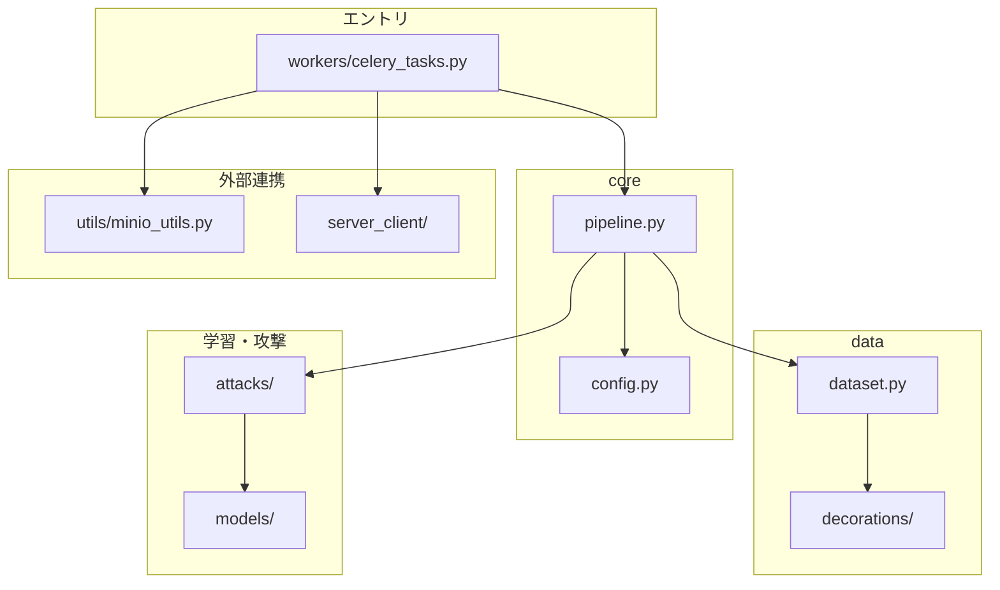

| パス | 役割 |
|------|------|
| `core/` | 環境変数・定数・実験パイプライン |
| `data/` | CIFAR-100 分割・装飾・DataLoader |
| `models/` | TargetCNN / AttackNet |
| `attacks/` | Offline / Online LiRA / Shokri MIA |
| `workers/` | Celery タスク |
| `utils/` | MinIO アップロード・ダウンロード |
| `server_client/` | 自動生成 API クライアント |

---

## ジョブ処理フロー

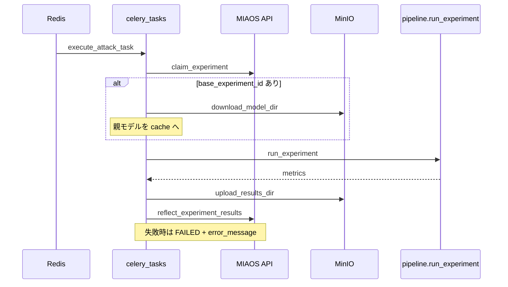

---

## 実験パイプライン（`pipeline.py`）

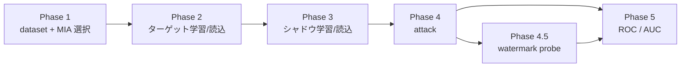

| Phase | 内容 |
|-------|------|
| 1 | `dataset(work_dir, request)` 構築（分割は request のみ参照）、`MIA_OfflineLiRA` / `MIA_OnlineLiRA` / `MIA_Shokri` 選択 |
| 2 | `TargetCNN` 学習、または `assigned_model_path` から `load_target_model` |
| 3 | シャドウ複数学習、または `assigned_model_path` から `load_shadow_model` |
| 4 | `attack()` → メンバーシップスコア・真値 |
| 4.5 | `decoration_config.has_watermark()` 時のみ `WatermarkProbeAnalysis` |
| 5 | `comprehensive_evaluate` → `roc_curve.png` 等 |

`attack()` の戻り値は `(scores, trues)`。`comprehensive_evaluate(scores, trues)` の引数順と一致。

ログ: `work_dir/execution.log` + stdout

---

## `data/` — 責務分担

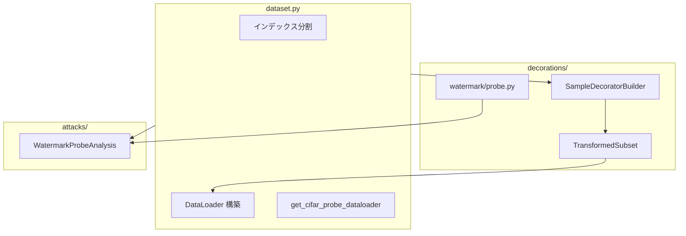

| モジュール | 責務 |
|-----------|------|
| `dataset.py` | CIFAR 分割、`get_*_dataloaders`、CIFAR 対照 probe |
| `decorations/` | 装飾設定パース・適用・透かし I/O |
| `watermark_probe.py` | 透かし probe 解析（`build_probe_dataloader` 利用） |

`dataset` は透かしの MinIO 取得や probe PIL 生成を**持たない**。`SampleDecoratorBuilder.get_watermark_loader()` 経由で透かし層に委譲する。

---

## データ分割

`dataset.json` は使わない。毎回 `CreateExperimentRequest` の入力から分割を再計算する。

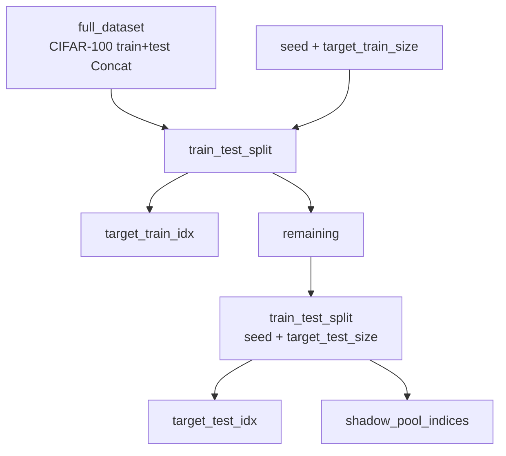

シャドウ分割は `shadow_pool_indices` から `seed + i` で毎シャドウ再計算（`dataset.json` に保存しない）。

### `base_experiment_id` の契約

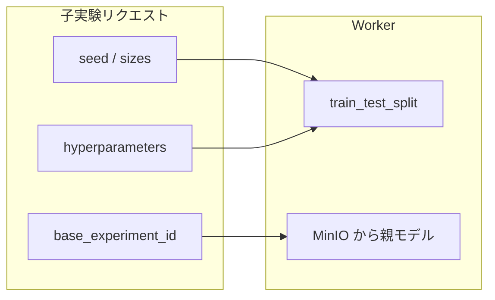

親モデル流用時、呼び出し側が親と**同じ `seed` / `target_train_size` / `target_test_size`** を指定することで同一分割を再現する。Worker は親パラメータを API から取得しない。

### DataLoader 対応

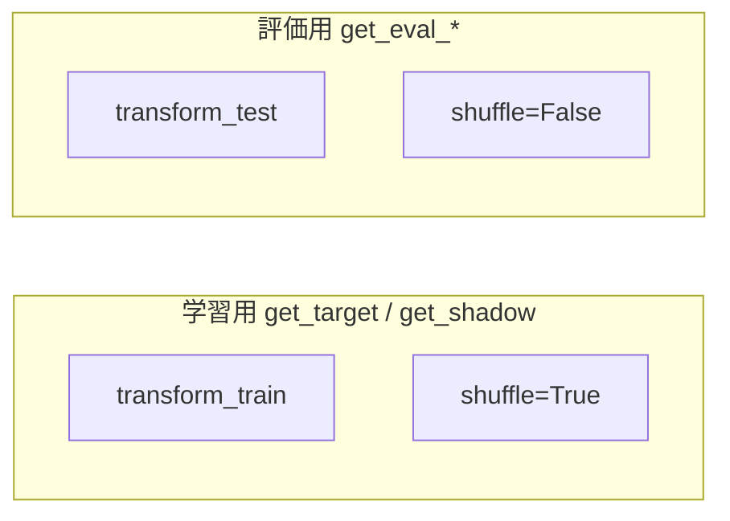

---

## `data/decorations/` — サンプル装飾

設定の唯一の経路: `hyperparameters.eval_decoration` / `target_train_decoration`  
1 サンプルに同時適用する装飾は 1 種類。Normalize 前の PIL 段階で適用。

### モジュール構成

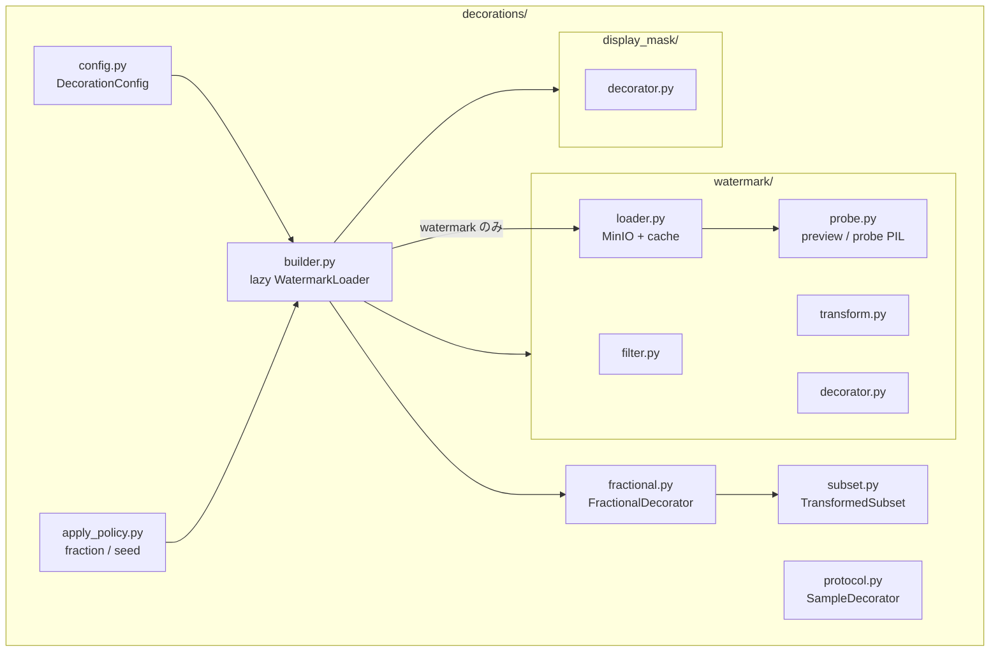

### `WatermarkLoader` の lazy 初期化

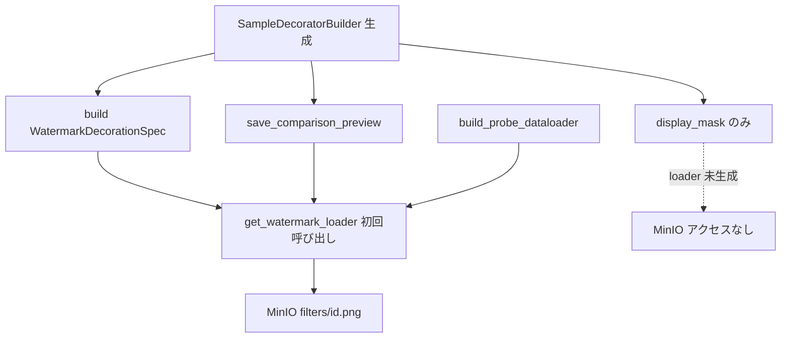

透かし装飾が不要な実験では `WatermarkLoader` は作られない。

### 装飾パイプライン

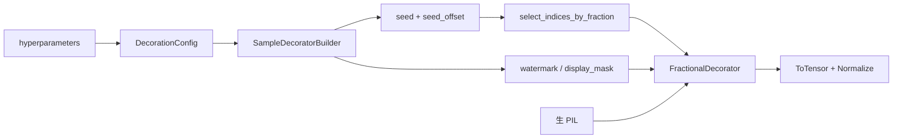

### 設定例

```json
{
  "eval_decoration": {"type": "watermark", "filter_id": "circle", "fraction": 1.0},
  "target_train_decoration": {
    "type": "display_mask",
    "width": 16, "height": 16, "position": [0, 0],
    "fraction": 0.5, "seed_offset": 0
  }
}
```

| キー | 適用先 |
|------|--------|
| `eval_decoration` | `get_eval_target_dataloaders` / `get_eval_shadow_dataloader` |
| `target_train_decoration` | `get_target_dataloaders` の train |

| `type` | パラメータ |
|--------|-----------|
| `watermark` | `filter_id`, `fraction`（省略時 1.0）, `seed_offset`（省略時 0） |
| `display_mask` | `width`, `height`, `position`（`[x,y]` または `x`/`y`）, `fraction`, `seed_offset` |

**適用ポリシー（全装飾共通）**

- 選定シード: `experiment.seed + seed_offset`
- 同じ `fraction` + `seed_offset` + 同じ pool → type が違っても同一サンプルに適用
- 透かしフィルタ: `WatermarkLoader` が MinIO `filters/{filter_id}.png` を `./cache/filters/` に取得
- デバッグ: 透かし有効時 `work_dir/watermark_preview_{eval|target_train}.png`（role ごとに `save_comparison_preview`）

### 透かし probe フロー（Phase 4.5）

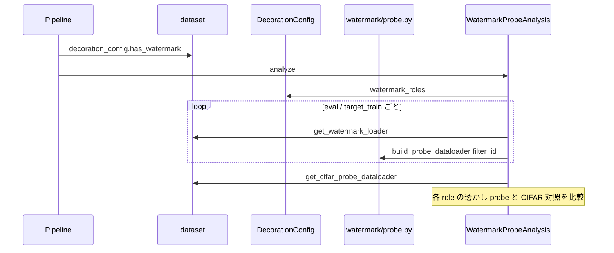

`CreateExperimentRequest.watermark`（トップレベル）は**無視**。装飾は `hyperparameters` のみ。

---

## `attacks/` — MIA 手法

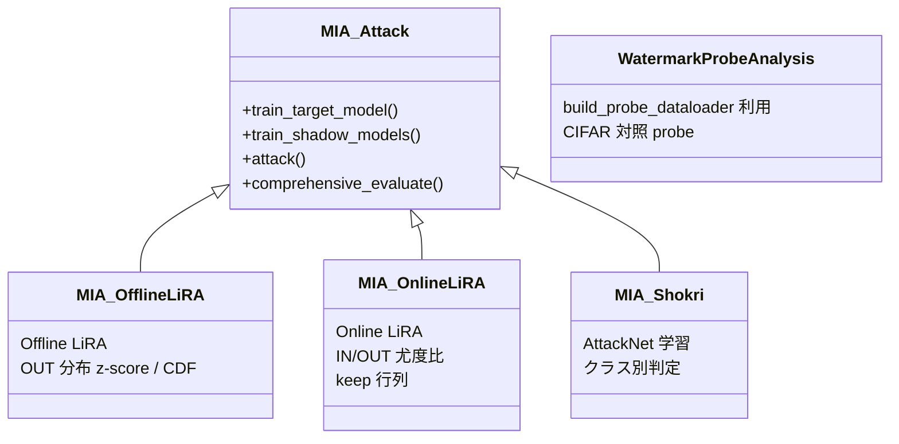

| クラス | 概要 |
|--------|------|
| `MIA_Attack` | 学習・予測・ROC 共通基底 |
| `MIA_OfflineLiRA` | シャドウ OUT 分布から z-score → CDF スコア（論文 Equation 4） |
| `MIA_OnlineLiRA` | シャドウ IN/OUT 分布から対数尤度比スコア（論文 Algorithm 1） |
| `MIA_Shokri` | ソフトマックス特徴 → `AttackNet` |
| `WatermarkProbeAnalysis` | `watermark_roles` ごとに probe を実行し、CIFAR 対照と prediction 差を比較 |

### LiRA 共通モジュール（`mia_lira_common.py`）

- `logit_scaling` — 正解クラス確率のロジット変換
- `extract_shadow_logits_matrix` — 全シャドウモデルからロジット行列 `(num_shadows, num_samples)` を抽出
- `save_lira_artifacts` / `plot_score_distributions` — アーティファクト保存・可視化

手法別スコア計算は各モジュールに配置:

- `mia_offline_lira.compute_offline_lira_scores` — OUT 分布 + CDF（Equation 4）
- `mia_online_lira.compute_online_lira_scores` — IN/OUT 尤度比（Algorithm 1）

### Offline vs Online LiRA

| 項目 | Offline (`MIA_OfflineLiRA`) | Online (`MIA_OnlineLiRA`) |
|------|----------------------------|---------------------------|
| シャドウ学習 | `shadow_pool` のみ（攻撃対象は常に OUT） | `shadow_pool` + クエリサンプル（IN/OUT を keep 行列で制御） |
| 分布推定 | OUT のみ (`μ_out`, `σ_out`) | IN / OUT 両方 |
| スコア | `Φ((conf - μ_out) / σ_out)` | `logpdf(conf\|IN) - logpdf(conf\|OUT)` |
| 追加成果物 | `lira_artifacts/` | 上記 + `online_lira_keep.npy`（keep 行列） |

Online LiRA の keep 行列は `dataset.build_online_lira_keep_matrix` で生成し、各クエリサンプルが `num_shadow_models // 2` 個のシャドウで IN になるよう割り当てる。`load_shadow_model=True` で Online LiRA を実行する場合、`online_lira_keep.npy` が同ディレクトリに必須（Offline で学習したシャドウは流用不可）。

---

## `models/`

| モジュール | 用途 |
|-----------|------|
| `TargetCNN` | CIFAR-100（3×32×32, 100 クラス）ターゲット・シャドウ共用 |
| `AttackNet` | Shokri 用 2 クラス MLP |

---

## MinIO 連携（`utils/minio_utils.py`）

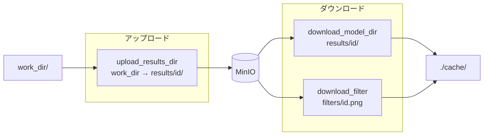

---

## `server_client/`

OpenAPI 生成の httpx クライアント。ワーカーで主に使用:

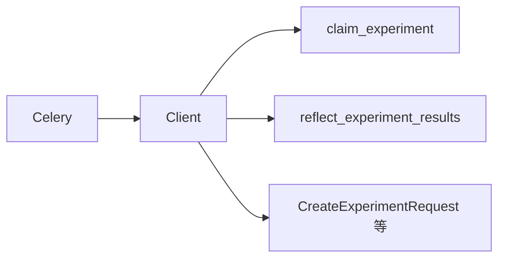

---

## 環境変数

| 変数 | 用途 |
|------|------|
| `PC_NAME` | ワーカー識別名 |
| `REDIS_URL` | Celery ブローカー |
| `MINIO_URL` / `ACCESS_KEY` / `SECRET_KEY` / `BUCKET_NAME` | オブジェクトストレージ |
| `MIAOS_API_URL` | オーケストレータ API |

`core/config.py` 参照。`DEVICE` は CUDA 利用可能なら GPU。

---

## import 規約

`from src.core.pipeline import run_experiment` のように `src.` プレフィックス付き。  
実行時はプロジェクトルート（または `PYTHONPATH` に worker）を含む構成を前提とする。

## 関連ファイル（`data/` 抜粋）

```
data/
├── dataset.py
└── decorations/
    ├── protocol.py
    ├── apply_policy.py
    ├── fractional.py
    ├── config.py
    ├── builder.py
    ├── subset.py
    ├── watermark/
    │   ├── filter.py
    │   ├── transform.py
    │   ├── loader.py
    │   ├── decorator.py
    │   └── probe.py
    └── display_mask/
        └── decorator.py
```
